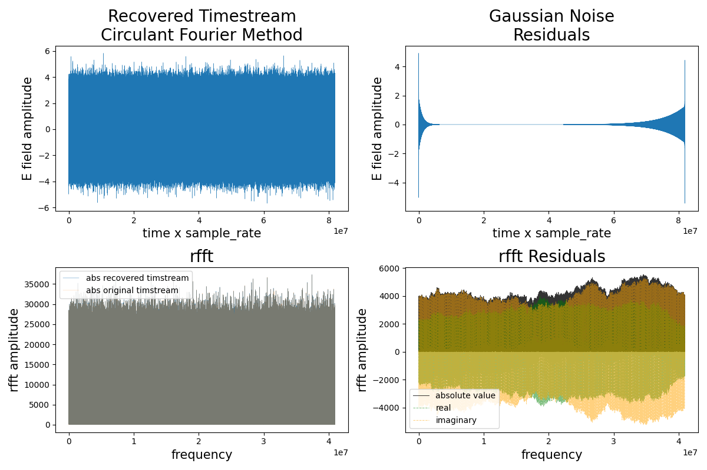
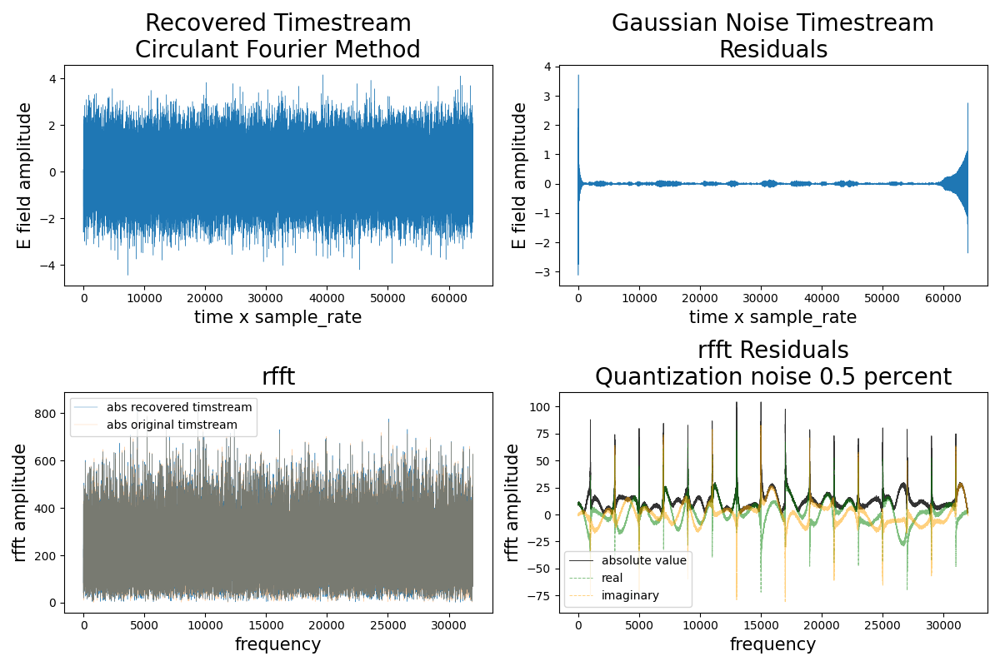
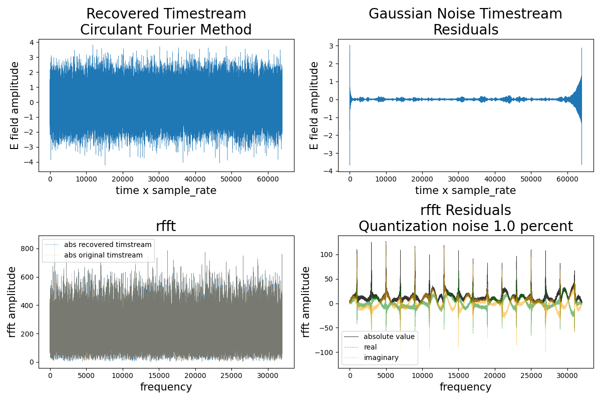
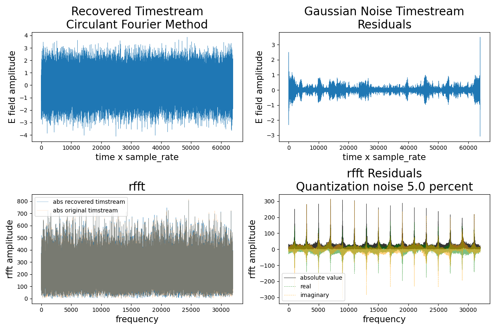
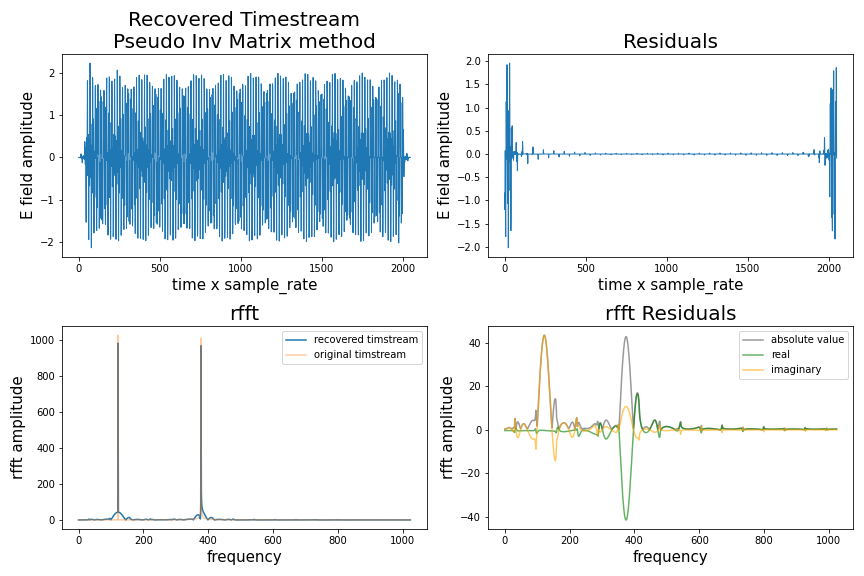
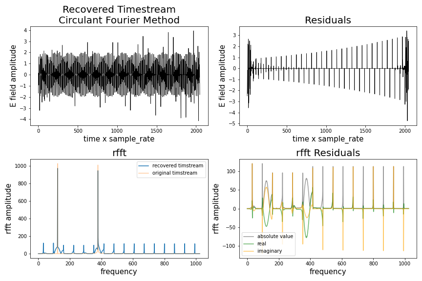

# Recovered Timestream Residuals

Here are some plots of the forward and backward pfb (see ``pfb.py``). This one is the longest timestream my computer can handle and plot. Interestingly the PFB and it's inverse can handle a numpy float64 array of up to 5\*10^8 entry timestream but not matplotlib, have to downsample to plot.  

The three following pngs are what the residuals look like when quantization effects are taken into account. (we don't actually quantize the pfb but simulate that by adding gaussian noise, the standard deviation of that noise added is is indicated on the plots)

With 0.5% noise

With 1% noise

With 5% noise

Richard Shaw also implemented a pseudo-inverse matrix in ``notes.ipynb`` of [this repository](https://github.com/jrs65/pfb-inverse). Here is how the pseudo-inverse method with circulant boundary conditions (described in [the write-up](../../writeup/pfb_writeup.pdf)) squares up to this matrix implementation for short timestreams.

Richard Shaw's pseudo-inverse matrix method for reconstructing two sinewaves.

The circulant boundry conditions method (same method as in other plots). This method performs better on longer timestreams.

